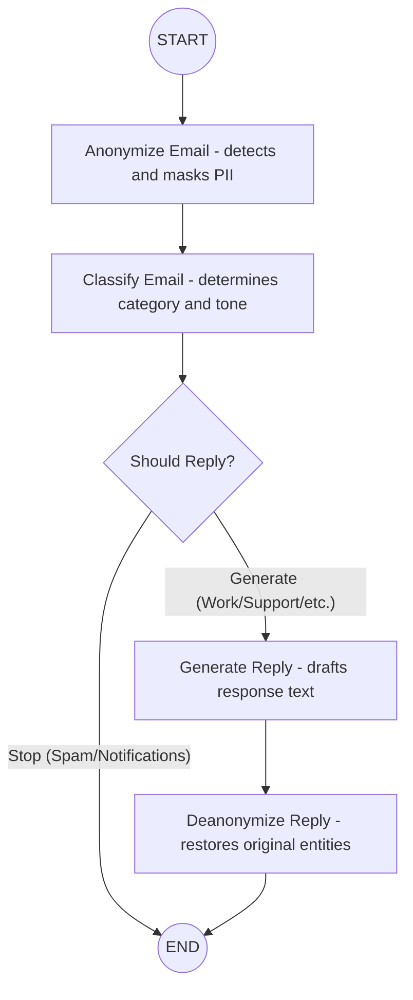

# Email Assistant Agent

The Email Assistant is a LangGraph-powered agent designed to automate the process of classifying and replying to emails while maintaining data privacy. It leverages Natural Language Processing for both structural analysis and content generation.

## Architectural Overview

The agent is built using LangGraph, which allows for a stateful, multi-step workflow. The state of the agent is tracked using the EmailSchema, which carries the original email, the anonymized version, classification data, and the final response.

### Workflow Diagram



## Core Components

### 1. Privacy Protection (Anonymization)
Before any data is processed by the Large Language Model (LLM), the email passes through the anonymize_email node.
- Technology: Uses Microsoft Presidio (Analyzer and Anonymizer).
- Process: It scans the email for sensitive entities like names, phone numbers, and addresses. It replaces them with tokens (for example, <PERSON>, <PHONE_NUMBER>).
- Purpose: Ensures that no PII is exposed to the LLM during classification or generation.

### 2. Intelligent Classification
The classify_email_node uses an LLM to analyze the intent and context of the email.
- Categories: Work, Personal, Spam, Finance, Support, and others.
- Output: Returns a JSON object containing the category, confidence level, reason, and detected tone.

### 3. Conditional Filtering
Not every email requires a response. The filtered_email_reply logic acts as a router:
- Automatic Termination: Categories like Spam / Marketing, Promotions, or Notifications / Alerts trigger a "stop", ending the graph immediately.
- Actionable Emails: Business, Support, and Personal emails move forward to the reply generation stage.

### 4. Response Generation
The generate_email_reply node drafts a professional response.
- Context Awareness: It uses the masked version of the email so it never sees the actual names or sensitive details, yet it can refer to them using the <ENTITY> placeholders.
- Prompt Engineering: Instructed to be concise, polite, and structured.

### 5. Final Assembly (Deanonymization)
The deanonymize_email node is the final step before the user sees the output.
- Process: It maps the tokens in the generated reply back to their original values stored in the agent's state.
- Result: A drafted email with the correct names and details restored, ready to be sent.

## Technical Stack
- Framework: LangGraph
- LLM Overlay: LangChain
- Privacy Engine: Microsoft Presidio
- Validation: Pydantic
- Language: Python 3.12+

## Development

1. Install dependencies:
```bash
pip install -e .
```

2. Configure environment:
Create a .env file with your API keys.

3. Run the agent:
```bash
langgraph dev
```
